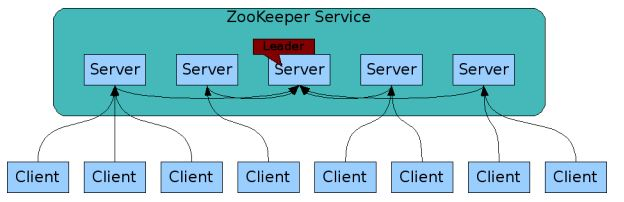
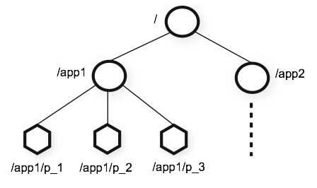
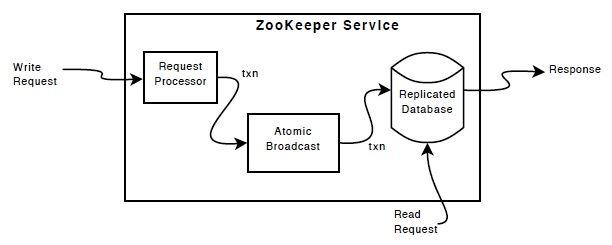
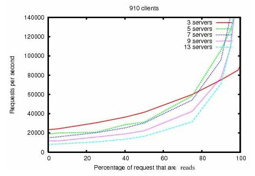

- 1 ZooKeeper是什么
- 2 zk的设计目标
- 3 数据模型和层级命名
- 4 Nodes和临时nodes
- 5 watch
- 6 zk的特性
- 7 simple API
- 8 zk实现
- 9 zk使用
- 10 性能

- zk组件重要概念

#### 1 ZooKeeper是什么
ZooKeeper是一个集中式服务，用于维护配置信息、命名、提供分布式同步、提供组服务等。所有这些服务都被分布式应用程序使用，每次实现这些服务都需要投入大量工作修复错误和竞争条件。由于实现此类服务很困难，应用程序最初通常会忽略它们，这使得它们在发生变化时变得脆弱并且难以管理，即使正确完成，这些服务的不同实现也会导致部署应用程序时的管理复杂性。

zk是一个面向分布式应用的分布式、开源的协调服务。zk开放一组原语，分布式应用可以用于实现高阶服务，例如：同步、配置维护、组服务和命名服务。

#### 2 zk的设计目标
- 简单的数据结构(zk is simple)
  zk使得分布式程序通过一个共享树形结构名字空间相互协调，即zk服务器内存中数据模型是由一系列ZNode数据节点组成。zk把数据存储在内存中，提高服务器吞吐、减少延迟的目的；

- 支持构建集群(zk is replicated)
  zk集群一般由一组机器构成，其中每台机器都会在内存维护当前服务器状态，且每台机器可相互通信；
  

- 顺序访问(zk is ordered)
  对于每个来自客户端的更新请求，zk会分配全局唯一的递增编号，编号反映所有事务操作的先后顺序；

- 高性能(zk is fast)
  在读请求占主导的负载中，zk处理非常快。zk服务运行在数千台机器，在读/写请求比例约10:1情况下，处理性能最优。

#### 3 数据模型和层级命名
zk的命名空间非常类似标准文件系统。一个名称是一组路径序列。所有Node都按路径区分。

##### 4 Nodes和临时nodes
不同于标准文件系统，所有zk node有关联的数据和子节点。就像一个文件系统，允许文件同时是目录。（zk天生设计用来保存状态数据、配置数据、位置数据等，所以每个node中数据量非常小，在1kb范围内。）使用术语`znode`表示zk 数据节点。

znode中数据的读写是原子操作。读请求获取znode关联的所有数据，写请求会替换所有数据。每个znode使用ACL限制对znode的操作。
zk的临时nodes，当创建znode的session是active状态时临时nodes创建，session结束后临时nodes被删除。

##### 5 watch
zk支持`watch`。client可以在znode上设置watch。当znode发生变化时，watch 将被触发并移除。当触发watch时，客户端会收到一个数据包，表明znode已更改。如果客户端和其中一台ZooKeeper服务器之间的连接断开，客户端将收到本地通知

#### 6 zk特性(guarantees)
- 顺序一致性，从同一个客户端发起的事务请求，会严格按照其`发起顺序`被应用到zk
- 原子性，事务请求要么成功，要么失败，不会出现部分结果情况。
- 单一视图，不论客户端连接哪个zk server，其看到服务端模型都是一致的
- 可靠性，一旦服务端成功应用一个事务，并完成对客户端响应，该事务引起的服务端状态变更会一直保留
- 实时性，zk保证在一定时间内，客户端最终一定能从服务端读取到最新的数据状态

#### 7 simple API
zk开放一组简单编程API，支持如下操作：
- create: 在数据模型树某个位置创建znode
- delete：删除znode
- exists：判断znode是否存在
- get data：从znode读取数据
- set data: 写数据
- get children：检索子节点列表 
- sync：同步

#### 8 zk实现
zk服务的high-leverl组件如下图，除了request processor，所有zk server都会复制组件副本。

replicated database是一个内存数据库。事务请求会被日志记录到磁盘用于恢复，写请求会在应用到内存数据库前被持久化到磁盘。
所有的zk server会服务client。client仅能连接到一个server。读请求从server本地database副本获取数据。修改服务状态的请求、写数据请求都会由一致协议处理。（总结来说，读数据吞吐量随着zk servers数量增大而增大，但写数据吞吐量随着集群数量增多而减小。）

作为一致协议的一部分，写数据请求会被转发到一个单一leader节点。其他zk severs作为followers，接收消息提案并投票是否发送消息。消息层负责替换失败leader，同步followers与leaders。

#### 9 zk使用
zk的API非常简单。用户可实现高阶操作，例如：同步原语、组成员、拥有权等

#### 10 性能
读请求远超写请求时，zk获得高性能（分布式协调服务是典型的读请求数量大于写请求）

